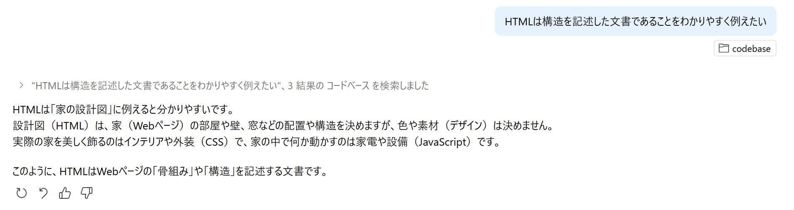

# Introduction

おはこんばんにちは。これからJavaScriptを学ぶにあたって、重要なことといらんことをつらつら書いていきます。ちなみに今は2025/08/12 02:01です。何が言いたいかというと深夜テンションです。~~なお17時起き~~

## そもそもJavaScriptって？

みなさんは普段Webページを見るとき、意識せずともJavaScriptを使っています。~~阿部寛のページには多分ないと思いますが。~~

JavaScriptの話をする前に、Webページの表示の仕組みを知っておく必要があります。ブラウザでURLにアクセスするとき、いろいろ(詳細は省きます)あってサーバーからWebページのデータをもらってきます。このデータに入っているのが、

- HTML
- CSS
- JavaScript

の3つです。

HTMLは構造を記述した文書です。

GPT-4.1が全部説明してくれたので、もう言うことがありません。~~これでこのゼミは終了です。~~

補足するなら、CSSとJavaScriptはなくてもページを表示できますが、HTMLがないと何も見えません。設計図ないからそりゃそう

このゼミでは最終的にWebアプリか拡張機能の作成を目標にしています。その過程でHTMLとCSSも書いてもらいますが、これを詳しく解説すると4本ぐらいゼミが建つので、最低限のみにします。~~あとムズすぎて沼る~~

さて、さっきのサーバーからもらってきた3つのデータのうち、ページを開いたときにHTMLとCSSはブラウザが勝手に食って表示してしまいます。その次に、JavaScriptがあればそれを実行するわけです。なお、JavaScript以外は実行できません。勝手にPythonを送りつけられたって、ブラウザはPythonエンジンを持っていないので、何も起きません。

「その次に」というのが重要で、覚えてほしいのが、

**「JavaScriptはイベント駆動型」**

です。

な... 何を言ってるのか わからねーと思うが あ... ありのまま概要を話すぜ！

JavaScriptは、JavaScript実行エンジンに、「このボタンが押されたときに、この関数を実行してくれ」と、伝えます。これだけです。
たとえば、「ボタンを押したらアラートが出る」などです。demo.htmlをブラウザで開いてみてください。

つまり、ただ処理を書いただけでは、ページを開いたときに1回だけ実行されるだけなので、「それもうHTMLに書けよ」となります。
JavaScriptをJavaScriptたらしめるためには、EventEmitterと呼ばれるトリガーに関数を登録する必要があります。

飽きたのでここらへんでやめます。次回は開発環境の紹介です。

## 追記 実行環境について

02-Env書いてたら思い出しました。JavaScriptの実行環境についてです。
さっき触れたように、ブラウジングにはWebサーバーとブラウザが関わっています。JavaScriptはサーバーでもブラウザでも扱えます。
JavaScriptは、もともとブラウザの中で動く言語ですが、サーバー側でも「Node.js」というソフトウェアを使って動かすことができます。
Node.jsはサーバー用のプログラムを書くためだけでなく、開発を便利にするツールを動かすためにも使われます。

つまり、普段はブラウザで動くJavaScriptですが、開発のときはNode.jsを使って「コードを自動で整形したり」「新しい書き方を古いブラウザ向けに変換したり」することができます。
このため、Webアプリを作るときはNode.jsも一緒にインストールしておくのが一般的です。

余談: JavaScriptのバージョンの話

JavaScriptのバージョン（ECMAScript）は、どの環境で動かすかによって使える機能が変わります。
最新のChromeやEdge、Firefox、Safariなどのブラウザは、アップデートによって新しいESの機能にどんどん対応していきます。そのため、ユーザーがブラウザを最新にしていれば、モダンな書き方も使えるようになります。

一方、Internet Explorer（IE）はすでにサポートが終了しており、今後アップデートされることもありません。IEはES5までしか対応していないため、ES6以降の新しい機能は使えません。

Node.jsもバージョンアップで新しいESに対応していきますが、基本的に最新の機能が使いやすい環境です。

まとめると：

JavaScriptの新しい機能（ES）は、ブラウザやNode.jsの「バージョン」によって使えるかどうかが決まる
モダンなブラウザはアップデートで対応範囲が広がる
IEはアップデートがなく、古い機能（ES5）までしか使えない
どの機能が使えるかは「どこで動かすか」と「その環境のバージョン」による

最後の方面倒になってGitHub Copilotに書かせました。楽でいいですね
